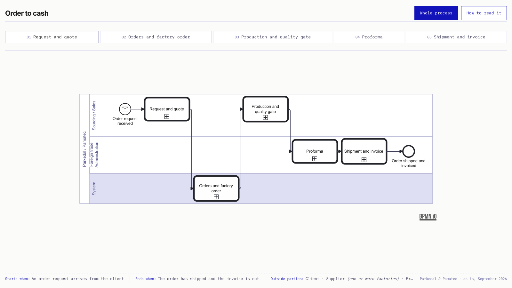

# Parkedal order to cash

A real end-to-end process: a Uruguayan trading company buys from factories in China for brands in Latin America. Drawn as-is from the running system in September 2026, in BPMN 2.0, Descriptive sub-class, as five chapters plus a collapsed overview.

Read it as a page: https://matiaswas.com/parkedal-process



## Files

| File | What it is |
|---|---|
| `overview.bpmn` | The five chapters as collapsed call activities in three lanes. |
| `chapter-01.bpmn` | Request and quote |
| `chapter-02.bpmn` | Orders and factory order |
| `chapter-03.bpmn` | Production and quality gate |
| `chapter-04.bpmn` | Proforma |
| `chapter-05.bpmn` | Shipment and invoice |

Each chapter is a self-contained collaboration: its own start and end events named as states, only the lanes and outside parties it uses, no data objects (documents are named on the message flows). No coordinate was written by hand; every diagram comes from a spec and a deterministic layout.

## Checker results

```
node scripts/check.mjs examples/parkedal-order-to-cash/<file>
```

| File | Verdict | Findings |
|---|---|---|
| overview, chapter-01, 02, 03 | PASS | none |
| chapter-04 | FAIL | `fake-join` on two tasks (paths rejoin on the task, no merge gateway); `single-blank-start-event` (the chapter is entered from two states, so it has two start events) |
| chapter-05 | FAIL | 2143 by 783 px, over the page budget of 1600 by 1000 |

The two failures are decisions, not accidents. Merge gateways were removed on purpose: a diamond without a question names nothing a reader can act on, so converging paths land on the next step. Chapter 05 was kept whole on purpose: the author preferred five chapters and accepts that the last one draws small on a laptop. Both are the kind of trade the checker exists to make visible.
